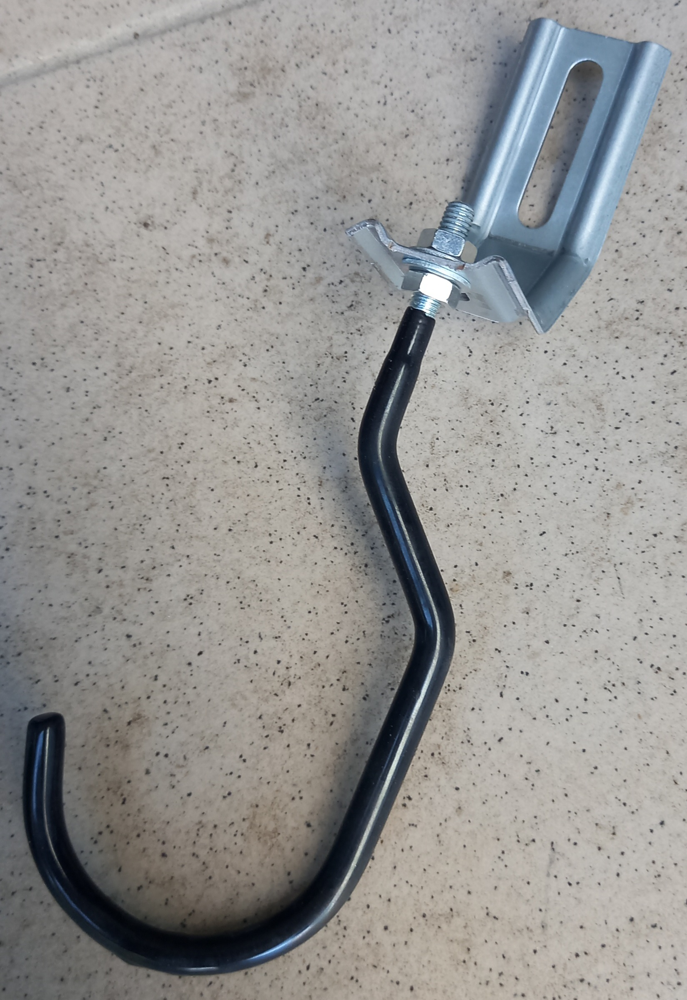
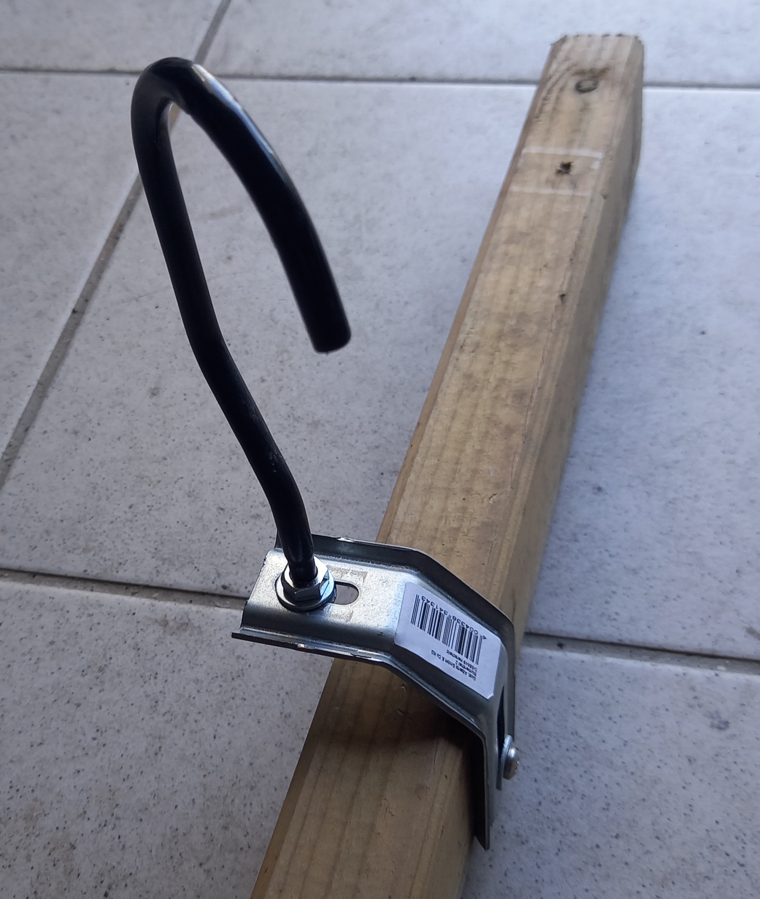
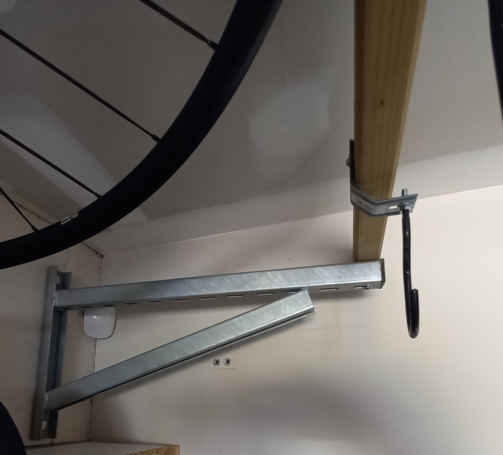
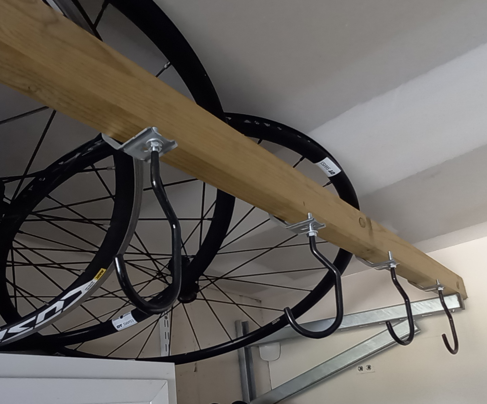

# 🚲 Bike Rack

## 📋 Description
This rack was inspired by the version sold on decathlon.fr, which is very affordable but had brackets that were too short for my setup.  
The design presented here was partially built using recycled materials (mainly screws). Feel free to adapt the components if you already have similar parts on hand.  

Bike rack system to store multiple bicycles compactly and accessibly.  
Designed to optimize space in a garage or bike room.  

---

## 📂 Table of Contents
1. [Features](#features)
2. [Bill of Materials (BOM)](#bill-of-materials-bom)
3. [Required Tools](#required-tools)
4. [Assembly Instructions](#assembly-instructions)
5. [Maintenance and Safety](#maintenance-and-safety)
6. [License](#license)

---

## 📐 Features
- Capacity: 4 bikes, extendable if needed
- Maximum load: approximately 50 kg, depending on the number of brackets used

---

## 📦 Bill of Materials (BOM)
See [`bom/bom.csv`](bom/bom.csv) for the complete list.

| Qty | Brand     | Reference  | Description                                  | Supplier                 | Indicative price | Wall mount | Ceiling mount | Recycled material |
|-----|-----------|------------|----------------------------------------------|--------------------------|------------------|------------|---------------|------------------|
| 2   | WÜRTH     | 0862009043 | VARIFIX Heavy-duty bracket 36/36 600 mm      | ventil.fr / contorion.fr | 45 €             |     X      |               |                  |  
| 1   | RED HEAD  | 25039036   | Pack of 4 G2X 16x65 mm heavy-duty wall plugs | bricomarche.fr           | 15 €             |     X      |               |                  |  
| 2   | VAR Tools | PR-70311   | Pair of M-size road bike hooks               | velo-store.fr            | 8 €              |     X      |       X       |                  |  
| 6   | Alberts   | PR-70311   | 3-sided galvanized bracket, 55x30x72 mm      | weldom.fr                | 2.2 €            |     X      |       X       |         X        |     
| 12  | Generic   | N/A        | Flat washer Ø6x2 mm                          | bricotdepot.fr           | N/A              |     X      |       X       |         X        | 
| 1   | Generic   | N/A        | Pine beam 70x45 mm, length 1.2 m             | bricotdepot.fr           | N/A              |     X      |       X       |         X        | 
| 4   | Generic   | N/A        | Round head steel screws Ø6 x L.30 mm         | bricotdepot.fr           | N/A              |     X      |       X       |         X        | 

---

## 🛠 Required Tools
- Drill/driver
- Concrete drill bit (16 mm)
- Wrenches (sizes 10 & 13)
- Spirit level
- Hand saw for wood

---

## 📜 Assembly Instructions

### Step 1 — Assemble the hooks
Attach the hooks to the brackets using nuts and washers.  
In my case, I prepared four of them.  
If you have thread-locking compound (e.g. Loctite), feel free to use it.  
Here’s an example of what you should get:

Next, fix them onto the wooden beam, making sure there is enough spacing so that the bikes don’t touch each other.

---

### Step 2 — Fix the brackets to the wall
Since the rack needs to support a heavy load, make sure to choose the right type of anchors for your wall.  
In my case, I had to fix them into cinder blocks, so I used RED HEAD heavy-duty wall plugs. This kit is normally designed for a hot water tank, so it’s more than strong enough for this application.

The spacing of the brackets must match the length of the wooden beam you are using. Once this is done, simply fix the beam onto the brackets using wood screws.  

Here’s what the finished rack looks like:

---

## 🧰 Maintenance and Safety
After a few weeks of use, check that all bolts and screws remain tight.  
If they tend to loosen, apply a bit of thread-locking compound on the hook bolts.  

---

## 📄 License
This project is licensed under [Creative Commons BY-SA 4.0](LICENSE).
